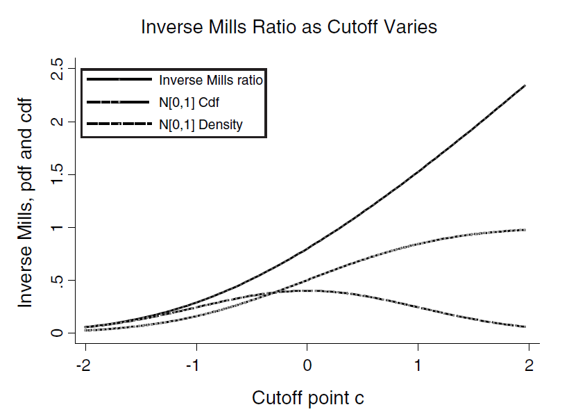

class: title-slide

```{r setup, include=FALSE}
knitr::opts_chunk$set(echo = FALSE, fig.path = "figures/")

library(tidyverse)
library(pacman)
library(janitor)
library(sandwich)
library(modelsummary)
#library(nnet)
#library(mlogit)
p_load(tidyverse, foreign, reshape2, psych, qwraps2, forcats, readxl, 
       broom, lmtest, margins, plm, rdrobust, multiwayvcov,
       wesanderson, sandwich, stargazer,
       readstata13, pscore, optmatch, kdensity, MatchIt, bootstrap, matlib, dplyr)

xfun::pkg_load2(c('base64enc', 'htmltools', 'mime'))

```

```{css, echo = FALSE}
.huge .remark-code { /*Change made here*/
  font-size: 200% !important;
}
.tiny .remark-code { /*Change made here*/
  font-size: 60% !important;
}

```


.title[
# Sesión 10. Modelos de selección
]
.subtitle[
## Econometría II
]
.author[
### Irvin Rojas <br> [rojasirvin.com](https://www.rojasirvin.com/) <br> [<i class="fab fa-github"></i>](https://github.com/rojasirvin) [<i class="fab fa-twitter"></i>](https://twitter.com/RojasIrvin) [<i class="ai ai-google-scholar"></i>](https://scholar.google.com/citations?user=FUwdSTMAAAAJ&hl=en)
]

.affiliation[
### Centro de Investigación y Docencia Económicas <br> División de Economía
]

---
# Agenda
  
1. Introduciremos una primera forma de manejar la selección

1. Estudiaremos la selección en los datos con dos posibles orígenes:

  - Comportamiento 

  - Tratamiento de los datos
  
1. Podemos arreglarlo modelando explícitamente el proceso de selección, pero haciendo supuestos distribucionales fuertes

---

class: inverse, middle, center

# Censura y truncamiento

---

# Mecanismos de censura y truncamiento

- Consideremos una variable latente $y^*$ que se observa de acuerdo a una regla de observación $g(\cdot)$

- Lo que observamos es $y=g(y^*)$

---

# Censura

- Siempre observamos $X$ pero no $y$:

  - Censura por abajo: $y=\begin{cases}y^* \quad \text{si }y^*>L \\ L \quad \text{si }y^*\leq L \end{cases}$
  
  - Censura por arriba: $y=\begin{cases}y^* \quad \text{si }y^*<U \\ U \quad \text{si }y^*\geq U \end{cases}$
  
- El típico ejemplo de censura se encuentra en los datos *top coded*, como los de ingreso

---

# Truncamiento

- Tanto $X$ como $y$ son no observados para ciertos valores de $y$

  - Truncamiento por abajo: $y=y^*$ si $y^*>L$ y no osbervada si $y^*\leq L$
  
  - Truncamiento por abajo: $y=y^*$ si $y^*>U$ y no osbervada si $y^*\geq U$

---

# Función de verosimilitud censurada

- La censura y el truncamiento cambian la función de verosimilitud de los datos observados


- Verosimilitud censurada (usando censura por abajo)

- Cuando $>L$, la densidad de $y$ es la misma que la de $y^*$, es decir, $f(y|x)=f^*(y|x)$

- Cuando $y=L$, la densidad es discreta con masa igual a la probabilidad de que $y^*\leq L$

- En resumen
$$
f(y|x)=
\begin{cases}
f^*(y|x) \quad\text{si } y>L \\
F^*(L|x)\quad\text{si }y=L \\
\end{cases}
$$
--

- La densidad es un híbrido entre una función de masa de probabilidad (una densidad propiamente) y una función de densidad acumulada

---

# Función de verosimilitud censurada

- Definamos

$$
d=
\begin{cases}
1\quad\text{si }y>L \\
0\quad\text{si }y=L \\
\end{cases}
$$

- Entonces la densidad condicional debido a la censura es:

$$f(y|x)=f^*(y|x)^dF^*(L|x)^{1-d}$$

--

- Y la función de log verosimilitud será
$$\mathcal{L}_N{\theta}=\sum_i\left(d_i\ln f^*(y_i|x_i,\theta) + (1-d_i)F^*(L_i|x_i,\theta)\right)$$

- Noten que hemos dejado abierta la opción de que $L$ difiera entre individuos, es decir, que $L=L_i$

- Si la densidad de $y^*$, $f^*(y^*|x,\theta)$, está bien especificada, $\theta_{MV}$ es consitente y asintóticamente normal

---

# Función de verosimilitud truncada

- Consideremos el caso de truncamiento por abajo

- Noten que la función de densidad de $y$ es:

$$
\begin{aligned}
f(y)&=f^*(y|y>L) \\
&=\frac{f^*(y)}{P(y|y>L)}\\
&=\frac{f^*(y)}{1-F^*(L)}
\end{aligned}
$$
--

- Entonces, la log verosimilitud truncada es:

$$\mathcal{L}_N{\theta}=\sum_i\left(\ln f^*(y_i|x_i,\theta)-\ln(1-F^*(L_i|x_i,\theta))\right)$$

---

class: inverse, middle, center

# Modelo Tobit

---

# Modelo Tobit

- Es una modelo simple y con supuestos muy fuertes sobre la estructura de la censura

- Tobin (1958) lo planteó originalmente como una forma de modelar la compra de bienes durables (muchos hogares gastan 0 en bienes durables)

--

- Consideramos un proceso con errores normales
$$
\begin{aligned}
&y^*=x'\beta+\varepsilon \\
&\varepsilon\sim\mathcal{N}(0,\sigma^2)
\end{aligned}
$$
- Supongamos que observamos $y$ de acuerdo a la siguiente regla:

$$
y=
\begin{cases}
y^*\quad\text{si }y^*>0 \\
-\quad\text{si } y^*\leq 0\\
\end{cases}
$$
---

# Modelo Tobit

- Con los errores normales, podemos definir la cdf como
$$
\begin{aligned}
F^*(0)&=P(y^*\leq0) \\
&=P(x'\beta+\varepsilon\leq 0) \\
&=\Phi(-x'\beta/\sigma) \\
&=1-\Phi(x'\beta/\sigma)
\end{aligned}
$$
--

- Esto nos permite definir la densidad censurada como
$$
f(y)=\left(\frac{1}{\sqrt{2\pi\sigma^2}}exp\left(-\frac{1}{2\sigma^2}(y-x'\beta)^2\right)\right)^d\left(1-\Phi\left(\frac{x'\beta}{\sigma}\right)\right)^{1-d}
$$
--

- Y entonces la función de log verosimilitud será:
$$
\begin{aligned}
\mathcal{L}_N(\beta,\sigma^2)&=\sum_i\left( d_i\left(-\frac{1}{2}\ln(\sigma^2)-\frac{1}{2}\ln(2\pi)-\frac{1}{2\sigma^2}(y_i-x'\beta)^2\right)+ \right. \\
&\left. +(1-d_i)\ln\left(1-\Phi\left(\frac{x_i'\beta}{\sigma}\right)\right) \right)
\end{aligned}
$$

---

# Condiciones de primer orden

$$\frac{\partial \mathcal{L}_N}{\partial \beta}=\sum_i\frac{1}{\sigma^2}\left(d_i(y_i-x_i'\beta)-(1-d_i)\frac{\sigma \phi_i}{1-\Phi_i}\right)x_i=0$$
$$\frac{\partial \mathcal{L}_N}{\partial \sigma^2}=\sum_i\left(di\left(-\frac{1}{2\sigma^2}+\frac{(y_i-x_i'\beta)^2}{2\sigma^4}\right)+(1-d_i)\left(\frac{\phi_ix_i'\beta}{(1-\Phi_i)2\sigma ^3}\right)\right)=0$$
--

- La solución se obtiene numéricamente

- $\hat{\theta}$ es consistente si la densidad está bien especificada

- El estimador de MV es asintóticamente normal: $\theta\stackrel{a}{\sim}\mathcal{N}(\theta,V(\hat{\theta})$

- Maddala (1983) y Amemiya (1985) proveen expresiones para la matriz de varianzas

---

# Nota sobre terminología

- El modelo Tobit fue plantado inicialmente para un problema de censura en cero

- Cuando nos refiramos al Tobit estaremos pensando en la estructura particular que tienen $y^*$ y $y$

- Si en vez de censura, ocurriera truncamiento, la log verosimilitud sería
$$\mathcal{L}_N(\beta,\sigma^2)=\sum_i \left(-\frac{1}{2}\ln(\sigma^2)-\frac{1}{2}\ln(2\pi)-\frac{1}{2\sigma^2}(y_i-x'\beta)^2-\ln\left(\Phi(x_i'\beta/\sigma)\right)\right)$$
---

# ¿Cuáles son las consecuencias de la censura y el truncamiento?

- Para ver las consecuencias de ignorar el truncamiento o la censura, consideremos el modelo lineal de variable latente 

$$E(y ^*|x)=x'\beta$$


- Consideremos la medica condicional censurada en cero

- Calculamos $E(y)$:
$$
\begin{aligned}
E(y)&= P(d = 0)E(y|d = 0) + P(d = 1)  E(y|d = 1) \\
&= 0 P(y∗ ≤ 0) + P(y∗> 0) E(y∗|y∗>0) \\
&= P(y∗> 0)  E(y∗|y∗> 0)
\end{aligned}
$$
--

Por tanto:

$$E(y|x)=P(\varepsilon>-x'\beta)(x'\beta+E(\varepsilon|\varepsilon>-x'\beta))$$
---

# ¿Cuáles son las consecuencias de la censura y el truncamiento?

- Veamos ahora la media condicional truncada en cero

$$
\begin{aligned}
E(y)&=E(y^*|y^*>0) \\
&=E(x'\beta+\varepsilon|x'\beta+\varepsilon>0) \\
&=E(x'\beta|x'\beta+\varepsilon>0)+E(\varepsilon|x'\beta+\varepsilon>0) \\
\end{aligned}
$$
- Por tanto

--

$$E(y|x,y>0)=x'\beta+E(\varepsilon|\varepsilon>-x'\beta)$$
--

- Aunque la media condicional de $y^*$ es lineal, la media condicional de $y^*$ no lo es

- El estimador de MCO es inconsistente en presencia de censura o truncamiento

- Notemos que una pieza clave para entender estos valores esperados es $E(\varepsilon|\varepsilon>-x'\beta)>0$

---

# Momentos truncados de la distribución normal

- Si $z\sim\mathcal{N}(0,1)$, la esperanza y varianza truncadas de la distribución truncada tienen las siguientes formas:

1. $E(z|z>c)=\frac{\phi(c)}{1-\Phi(c)}$ y $E(z|z>-c)=\frac{\phi(c)}{\Phi(c)}$

1. $E(z^2|z>c)=1+\frac{c\phi(c)}{1-\Phi(c)}$

1. $V(z|z>c)=1+\frac{c\phi(c)}{1-\Phi(c)}-\frac{\phi(c)^2}{(1-\Phi(c))^2}$

--

- Comúnmente a $\lambda(z)=\frac{\phi(z)}{\Phi{z}}$ se le conoce como **inverso de la razón de Mills**


---

# Medias condicionales en el modelo Tobit

.pull-left[
- Podemos entonces obtener una expresión para $E(\varepsilon|\varepsilon>-x'\beta)$:

$$
\begin{aligned}
E(\varepsilon|\varepsilon>-x'\beta)&=\sigma E\left(\varepsilon/\sigma|\varepsilon/\sigma>-x'\beta/\sigma\right) \\
&=\sigma \left(\frac{\phi(-x'\beta/\sigma)}{1-\Phi(-x'\beta/\sigma)}\right) \\
&=\sigma\frac{\phi(x'\beta/\sigma)}{\Phi(x'\beta/\sigma)}\\
&=\sigma\lambda(x'\beta/\sigma)
\end{aligned}
$$
- Finalmente, noten que:
$$
\begin{aligned}
P(\varepsilon>-x'\beta)&=P(-\varepsilon<x'\beta) \\
&=P(-\varepsilon/\sigma<x'\beta/\sigma)\\
&=\Phi(x'\beta/\sigma)
\end{aligned}
$$
]

.pull-right[
```{r, out.width="120%",fig.cap='Fuente: Cameron & Trivedi (2005)',fig.align='center'}

```

- Noten que $\lambda(z)$ es casi lineal en $c$ para valores de $c>0$
]

---

# Media y varianza condicional

- Los resultados anteriores nos permiten obtener expresiones para la media y varianza condicional de la distribución truncada **cuando $\varepsilon$ es normal**:

.pull-left[
- Truncada en cero
$$
\begin{aligned}
&E(y|x,y>0)=x'\beta+\sigma\lambda(x'\beta/\sigma) \\
&V(y|x,y>0)=\sigma^2(1-x'\beta\lambda(x'\beta/\sigma)-\lambda(x'\beta/\sigma)^2)
\end{aligned}
$$

- Censurada en cero
$$
\begin{aligned}
&E(y|x)=\Phi(x'\beta/\sigma)x'\beta+\sigma\phi(x'\beta/\sigma)\\
&V(y|x)=\sigma^2\Phi(x'\beta/\sigma)\left((x'\beta)^2+x'\beta\lambda(x'\beta)+1- \\ -\Phi(x'\beta/\sigma)(x'\beta+\lambda(x'\beta/\sigma))\right)
\end{aligned}
$$

]

.pull-right[
```{r, out.width="120%",fig.cap='Fuente: Cameron & Trivedi (2005)',fig.align='center'}
knitr::include_graphics("figures/cond_means.png")
```
]

---

# Efectos marginales

- Los resultados anteriores nos permiten derivar los efectos marginales para la variable latente $y^*$ y para la variable observada $y$

- Efecto marginal en la variable latente: $\frac{\partial E(y^*)}{\partial x}=\beta$

- Efecto marginal en la media truncada en cero: $\frac{\partial E(y,y>0|x)}{\partial x}=(1-x'\beta\lambda(x'\beta/\sigma)-\lambda(x'\beta/\sigma)^2)\beta$

- Efecto marginal en la media censurada en cero:
$\frac{\partial E(y|x)}{\partial x}=\Phi(x'\beta/\sigma)\beta$ <sup>1</sup>
  

.footnote[
[1] Para ver por qué esto es cierto, consideren un modelo con un solo regresor: $y=a+bx$. En este caso, la media censurada es $E(y|x)=\Phi(\frac{a+x}{\sigma})(a+bx)+\sigma\phi(\frac{a+bx}{\sigma})$. Calculamos la derivada:

$$\frac{\partial E(y|x)}{\partial x}=\Phi(\cdot)b+\left(\phi(\cdot)(a+bx)\frac{b}{\sigma}\right)+\sigma\phi'(\cdot)\frac{b}{\sigma}$$
Usamos ahora un resultado de estadística (Cameron & Trivedi, 2005, pág. 542): $f'(z)=-zf(z)$. Entonces:

$$\frac{\partial E(y|x)}{\partial x}=\Phi(\cdot)b+\left(\phi(\cdot)(a+bx)\frac{b}{\sigma}\right)-\phi(\cdot)(a+bx)\frac{b}{\sigma}$$

con lo que se obtiene el resultado.

]

---

# Efectos marginales

- ¿cuál efecto nos interesa? Depende de la pregunta

- A veces la censura o el truncamiento ocurren simplemente por una cuestión de recolección o codificación de datos, así que el objeto de interés sigue siendo $\frac{\partial E(y^*)}{\partial x}$

- Otras veces, la variable censurada o truncada tiene una interpretación de comportamiento económico
  
  - Horas trabajadas deseadas $y^*$ vs horas trabajadas observadas $y$
  
---

# Conclusión triste sobre el Tobit

- Relativamente simple y con resultados que pueden obtenerse de forma directa

--

- Recae en una especificación altamente restrictiva de errores normales y homocedásticos

- Poco usado en la práctica

- Es útil porque nos permitió estudiar las consecuencias de la censura y el truncamiento en un contexto muy simplificado

- Es de esperarse que estas consecuencias se sostengan y vuelvan incluso más complejo el análisis cuando $y^*$ y $y$ tienen estructuras más generales

---

class: inverse, middle, center

# Modelos en dos partes

---

# Modelos en dos partes

- En el modelo Tobit se asume que el mismo mecanismo determina el resultado que $y=0$ o $y>0$, y al mismo tiempo la magnitud de $y$ dado que $y>0$

- Modelamos dos procesos diferentes:

  - Participación: $d=\begin{cases} 1 \quad\text{si participa} \\ 0\quad\text{si no participa} \end{cases}$
  
  - Resultado: $y=\begin{cases} y \quad\text{si participa} \\ 0\quad\text{si no participa} \end{cases}$
  
--

- El modelo en dos partes está dado por:

$$
f(y |x)=
\begin{cases}
P(d=0|x)\quad\text{si }y=0 \\
P(d=1|x)f(y|d=1,x)\quad\text{si }y>0\\
\end{cases}
$$
--

- A este tipo de modelos también se les conoce como modelos de valla (*hurdle models*)

- Se usan como alternativa al Tobit en problemas de censura

---

# Ejemplo: modelo en dos partes Poisson

- Se relajan los supuestos de que los ceros y los positivos son generados por el mismo proceso generador de datos

- Los ceros se determinan por la densidad $f_i(\cdot)$, por lo que $P(y=0)=f_1(0)$

- Los conteos positivos están dados por $f_2(y|y>0)=\frac{f_2(y)}{1-f_2(0)}$, que se multiplica por $P(y>0)=1-f_1(0)$ para asegurar que las probabilidades sumen 1

--

- En este caso, el modelo en dos partes es:

$$
g(y)=
\begin{cases}
f_1(0) \quad\text{si }y=0 \\
\frac{(1-f_1(0))f_2(y)}{1-f_2(0)}\quad\text{si }y\geq 1 
\end{cases}
$$
- Una forma natural de especificar $f_2(\cdot)$ es con un proceso Poisson o negativo binomial

- El modelo se estima por máxima verosimilitud

---

# Ejemplo: modelo en dos partes Poisson

- Este modelo se puede pensar como

  1. Lanzamos una moneda no balanceada y determinamos si $y=0$ o si $y>0$
  
  2. Si $y>0$, entonces el conte Poisson sea realiza
  

- No necesitamos generar una densidad mezclada pues la densidad que resulta es un producto del proceso binomial y de conteo, por lo que el log de este producto es una suma

- En la tarea mostrarán que la función de log verosimilitud es la suma de dos log verosimilitudes, una para la parte Bernoulli y otra para la parte de conteo


---

# Modelos inflados en cero

- Una alternativa más son los modelos inflados en cero, aunque son mucho menos utilizados en economía

- Los modelos más comúnes inflados en cero son el Poisson inflado en cero y el negativo binomial inflazo en cero

- En este tipo de modelos la variable de respuesta se modela como una mezcla con una Bernoulli

$$
g(y)=
\begin{cases}
f_1(0)+(1-f_1(0))f_2(0) \quad\text{si }y=0 \\
(1-f_1(0))f_2(y) \quad\text{si } y \geq1 \\
\end{cases}
$$
---

# Ejemplo: modelo Poisson inflado en cero

- Si $y$ proviene de una distribución Poisson, sabemos que $f_2(0)=exp(-\lambda_i)$

- Por tanto, la densidad del modelo inflado en cero es:

$$
P(Y=y)=
\begin{cases}
\pi + (1-\pi) exp(-\lambda)\quad\text{si } y=0 \\
(1-\pi)exp(-\lambda)\lambda^y/y!\quad\text{si } y\geq 1 \\
\end{cases}
$$

---

class: inverse, middle, center

# Modelos de muestras seleccionadas

---


# Modelos de muestras seleccionadas

- Las muestras pueden estar seleccionadas

  - Por el econometrista
  
  - Por que los agentes escogen participar
  
--

- Ecuación de participación

$$
y_1=
\begin{cases}
1\quad\text{si } y_1^*>0\\
0\quad\text{si } y_1^*\leq 0
\end{cases}
$$
- Ecuación de resultados

$$
y_2=
\begin{cases}
y_2^*\quad\text{si } y_1^*>0\\
NA \quad\text{si } y_1^*\leq 0
\end{cases}
$$
- Por tanto

$$
\begin{aligned}
y_1^*=x_1'\beta_1+\varepsilon_1 \\
y_2^*=x_2'\beta_2+\varepsilon_2 \\
\end{aligned}
$$
- En el caso en que $y_1^*=y_2^*$, el modelo se colapsa al Tobit


---

# Modelo de Heckman

- No hay consenso de cómo llamarlo

- El estimador que veremos fue desarrollado por Heckman

- Algunos otros autores le llaman **Tobit de Tipo II** o **modelo con ecuación de selección**

- Supuesto: errores con distribución conjunta normal

$$
\begin{pmatrix} \varepsilon_1 \\ \varepsilon_2 \end{pmatrix}\sim \mathcal{N}\left(A, B \right)
$$
- $A=\begin{pmatrix} 0 \\ 0  \end{pmatrix}$

- $B=\begin{pmatrix} 1 & \sigma_{12} \\ \sigma_{21} & \sigma_2^2 \\ \end{pmatrix}$

- $\sigma_1^2=1$ es una normalización


---

# Resultados de la distribución normal conjunta

- Por nuestro supuesto de normalidad resulta que: $\varepsilon_2=\sigma_{12}\varepsilon_1 +\xi$

- $\xi$ es independiente de $\varepsilon_1$

--

- **Media truncada**

$$E(y_2|x,y_1^*>0)=x_2'\beta_2+E(\varepsilon_2|\varepsilon_1>-x_1'\beta_1)$$

- Usando el resultado de la normalidad de los errores:

$$
\begin{aligned}
E(y_2|x,y_1^*>0)&=x_2'\beta_2+E(\sigma_{12}\varepsilon_1+\xi|\varepsilon_1>-x_1'\beta_1) \\
&=x_2'\beta_2+\sigma_{12}E(\varepsilon_1|\varepsilon>-x_1'\beta_1) \\
&=x_2'\beta_2+\sigma_{12}\lambda(x_1'\beta_1)
\end{aligned}
$$
- Similarmente
$$V(y_2|x,y_1^*)=\sigma_2^2-\sigma_{12}^2\lambda(x_1'\beta_1)(x_1'\beta_1+\lambda(x_1'\beta_1))$$
---

# Resultados de la distribución normal conjunta

- **Media censurada**

- Cuando $y_2=0$ si $y_1^*<0$

$$
\begin{aligned}
E(y_2|x)&=E_{y_{1}^{*}}(E(y_2|x,y_1^*)) \\
&=P(y_1^*\leq 0 | x)\times 0+P(y_1^* > 0 | x)E(y_2^*|X,y_1^*>0) \\
&=0+\Phi(x_1'\beta_1)(x_2'\beta_2+\sigma_{12}\lambda(x_1'\beta_1)) \\
&=\Phi(x_1'\beta_1)x_2'\beta_2 + \sigma_{12}\phi(x_1'\beta_1)
\end{aligned}
$$
---

# Estimador de Heckman en dos etapas

- Algunos autores lo conocen como *heckit*

- Consiste en ver el problema como uno de *variable omitida* donde la variable omitida es $\lambda(x_{1i}'\beta_1)$

- Podemos pensar el problema en dos etapas:

  1. Probit de $y_1$ en $x_1$ usando toda la muestra, dado que asumimos que $P(y_1^*>0)=\Phi(X_1'\beta_1)$:
  
        - Usamos $\hat{\beta}_1$ para calcular el estimado del inverso de la razón de Mills: $$\lambda(x_i'\hat{\beta}_1)=\frac{\phi(x_1'\hat{\beta}_1)}{\Phi(x_1'\hat{\beta}_1)}=\hat{\lambda}(x_1'\hat{\beta}_1)$$

--
  1. Usamos los valores positivos de $y_2$ para estimar la regresión $$y_{2i}=x_{2i}'\beta_2+\sigma_{12}\lambda(x_{1i}'\beta_1)+v_i$$
  
---

# Estimador de Heckman en dos etapas

- Usando el resultado de la varianza truncada podemos estimar $$\sigma_2^2=\frac{1}{N}\sum_i(\hat{v}_i+\hat{\sigma}_{12}^2\hat{\lambda}_i(x_1'\beta_1+\hat{\lambda}_i))$$
donde $\hat{v}_i$ son los residuales estimados

- La correlación de errores puede ser estimada como $$\hat{\rho}=\hat{\sigma}_{12}/\hat{\sigma}_2$$

- Por tanto, una prueba de que $\rho=0$ o $\sigma_{12}=0$ es una prueba de si los errores están correlacionados y si es necesaria la correción por muestra seleccionada

- Poner atención a la significancia del inverso de la razón de Mills en la segunda etapa

---

# Errores estándar

- Para estimar la varianza hay que considerar dos cosas:

  1. Sabemos que $V(y_2|x,y_1^*>0) $ depende de $X$, es decir, la varianza es heterocedástica
  1. En la segunda etapa, $\hat{lambda}_i$ no es observado sino estimado
  
- Heckman (1979) provee las fórmulas de los errores correctos (R y otros paquetes ya lo implementan correctamente)

---

# Efectos marginales

- Definamos en un solo vector $x=[x_1\;x_2]$

- Podemos reescribir $x_1\beta_1=x'\gamma_1$ y $x_2'\beta_2=x'\gamma_2$, donde $\gamma_1$ y $\gamma_2$ tendrán algunas entradas iguales a cero si $x_1\neq x_2$

- Así, la media truncada es $$E(y_2|x)=x'\gamma+\sigma_{12}\lambda(x'\gamma_1)$$

--

- Y los efectos marginales relevantes son:

1. Proceso sin censura: $\frac{\partial E(y_2^*|x)}{\partial x}=\gamma_2$

1. Truncado en cero: $\frac{\partial E(y_2|x, y_1=1)}{\partial x}=\gamma_2-\sigma_{12}\lambda(x'\gamma_1)(x'\gamma_1+\lambda(x'\gamma_1))$

1. Censurado en cero: $\frac{\partial E(y_2|x)}{\partial x}=\gamma_1\phi(x'\gamma_1)x¿\gamma_2+\Phi(x'\gamma_1)\gamma_2-\sigma_{12}x'\gamma_1\phi(x'\gamma_1)\gamma_1$


---
# Próxima sesión

- Veremos algunos ejemplos aplicados:

  - **Tobit**: Zou, B., & Luo, B. (2019). Rural Household Energy Consumption Characteristics and Determinants in China. Energy.
  - **Heckman**: Parey, M., Ruhose, J., Waldinger, F., & Netz, N. (2017). The selection of high-skilled emigrants. *Review of Economics and Statistics*, 99(5), 776-792.
  - **Dos partes**: Colchero, M. A., Molina, M., & Guerrero-López, C. M. (2017). After Mexico implemented a tax, purchases of sugar-sweetened beverages decreased and water increased: difference by place of residence, household composition, and income level. *The Journal of nutrition*, 147(8), 1552-1557.
  - **Ordenado + selección**: Alemi, F., Circella, G., Mokhtarian, P., & Handy, S. (2019). What drives the use of ridehailing in California? Ordered probit models of the usage frequency of Uber and Lyft. *Transportation Research Part C: Emerging Technologies*, 102, 233-248.


---

class: center, middle

Presentación creada usando el paquete [**xaringan**](https://github.com/yihui/xaringan) en R.

El *chakra* viene de [remark.js](https://remarkjs.com), [**knitr**](http://yihui.org/knitr), y [R Markdown](https://rmarkdown.rstudio.com).

Material de clase en versión preliminar.

**No reproducir, no distribuir, no citar.**
