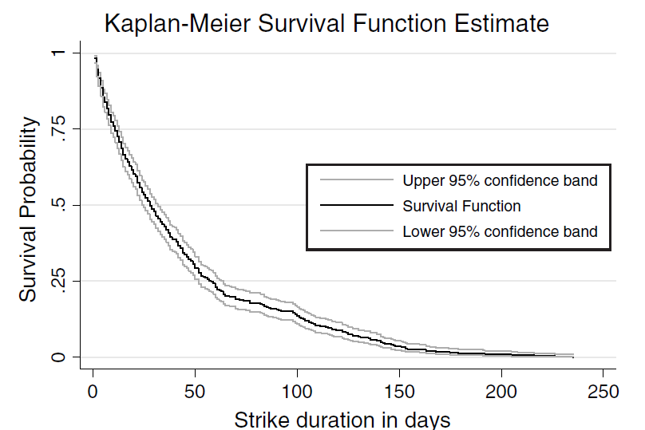

class: title-slide

```{r setup, include=FALSE}
knitr::opts_chunk$set(echo = FALSE, fig.path = "figures/")

library(tidyverse)
library(pacman)
library(janitor)
library(sandwich)
library(modelsummary)
#library(nnet)
#library(mlogit)
p_load(tidyverse, foreign, reshape2, psych, qwraps2, forcats, readxl, 
       broom, lmtest, margins, plm, rdrobust, multiwayvcov,
       wesanderson, sandwich, stargazer,
       readstata13, pscore, optmatch, kdensity, MatchIt, bootstrap, matlib, dplyr)

xfun::pkg_load2(c('base64enc', 'htmltools', 'mime'))

```

```{css, echo = FALSE}
.huge .remark-code { /*Change made here*/
  font-size: 200% !important;
}
.tiny .remark-code { /*Change made here*/
  font-size: 60% !important;
}

```


.title[
# Sesión 22. Modelos de duración
]
.subtitle[
## Econometría II
]
.author[
### Irvin Rojas <br> [rojasirvin.com](https://www.rojasirvin.com/) <br> [<i class="fab fa-github"></i>](https://github.com/rojasirvin) [<i class="fab fa-twitter"></i>](https://twitter.com/RojasIrvin) [<i class="ai ai-google-scholar"></i>](https://scholar.google.com/citations?user=FUwdSTMAAAAJ&hl=en)
]

.affiliation[
### Centro de Investigación y Docencia Económicas <br> División de Economía
]

---

# Motivación

- Hay problemas económicos que tienen una dimensión temporal de duración

  - Desempleo
  
  - Huelga
  
  - Vida de las empresas
  
- Podemos definir como variable de interés el fin de dichos eventos

- Nos interesa conocer cómo afecta un cambio en $x$ a la duración de los eventos

---

class: inverse, middle, center

# Modelos de duración

---

# Modelos de duración

- $F(t)$ es la función acumulativa de una variable aleatoria de duración $T$

- $f(t)$ es la densidad, con $f(t)=\frac{dF(t)}{dt}$

--

- Así, podemos definir la probabilidad de que la duración de un evento sea menor a $t$ como

$$P(T\leq t)=\int_0^tf(s)ds$$
- **Función de sobrevivencia**: es la probabilidad de que el evento sea mayor que $t$

$$S(t)=P(T>t)=1-F(t)$$

- **Función de riesgo (_hazard function_)**: probabilidad instantánea de dejar un estado, condicional a *sobrevivir* al tiempo $t$

$$\lambda(t)=\frac{f(t)}{S(t)}$$
---

# Modelos de duración

- Noten que como $f(t)=-\frac{dS(t)}{dt}$, entonces

$$\lambda(t)=\frac{f(t)}{S(t)}=-\frac{d}{dt}\ln S(t)$$
- Integrando $\lambda(t)$

$$
\begin{aligned}
\int_0^t \lambda(u)du&=-\ln S(u)\Big|_0^t \\
&=-(\ln S(t)-\ln S(0)) =-(\ln S(t)-\ln (1)) \\
&=-\ln S(t)
\end{aligned}
$$

- Por tanto, la función de sobreviviencia, es decir, la probabilidad de sobrevivir hasta $t$, es una función de la suma de los riesgos hasta $t$:

$$S(t)=exp\left(-\int_0^t\lambda(u)du\right)$$
---

# Modelos de duración

- Los demógrafos llaman **riesgo acumulado** a

$$\Lambda (t)=\int_0^t\lambda(x)dx$$

- Podemos ir de la sobrevivencia al riesgo acumulado y al revés

$$\Lambda(t)=\int_0^t\lambda(s)ds=-\ln S(t)$$

- Estos resultados muestran que podemos describir la distribución de $T$ por medio de $S(t)$ o de $\lambda(t)$

--

- Propondremos modelos para describir, por ejemplo, el riesgo en función de observables, $\lambda(t,x)$


---

class: inverse, middle, center

# Censura

---

# Censura

- En aplicaciones de duración la censura surge porque algunos eventos (vida, huelga, desempleo) se observan de forma incompleta

- Por ejemplo, en la ENOE podemos ver a las personas que cuando se hizo la encuesta estaban desempleadas

- Sin embargo, no sabemos cuándo terminó dicho periodo de desempleo

--

- Hay censura por la derecha cuando algunos eventos ya han termindo para cuando llegamos al periodo $c$, pero otros no

  - Pero para algunos otros, solo sabemos que terminarán en algún momento en el intervalo $(c,\infty)$
  
--

- La censura por la izquiera ocurre cuando sabemos que algunos eventos terminarán en el intervalo $(0,c)$, pero no se sabe exactamente cuándo

---

# Censura exógena o aleatoria

- Cada evento individual tiene una duración $T_i^*$ y un momento de censura $C_i^*$ que son independientes

  - Si el evento termina antes que ocurra la censura, observamos $T_i^*$
  
  - Si la censura ocurre primero, observamos $C_i^*$
  
- Entonces, los datos que vemos son realizaciones del siguiente proceso

$$T_i=min(T_i^*,C_i^*) \\ \delta_i=\mathcal{I}(T_i^*<C_i^*)$$

- Vemos pares $(t_1,\delta_1),(t_2,\delta_2),\ldots,(t_N,\delta_N)$

- La censura exógena o aleatoria surge su los individuos salen del estudio de forma aleatoria o porque el estudio termina


---

class: inverse, middle, center

# Estimación no paramétrica

---

# Estimación no paramétrica

- Consideremos un problema de duración en tiempo discreto, donde queremos modelar el momento en el que ocurre un evento (falla, muerte, fin del desempleo, fin de la huelga)

- Tenemos $k$ periodos, $t_1, t_2,\ldots,t_k$

- Tenemos $N$ individuos, $N\geq k$

- En el periodo $t_j$, $d_j$ es el número de eventos que terminan

--

- Para simplificar el análisis asumiremos cenusara por la derecha e independiente

- **Censura por la derecha**: hay eventos que terminan en algún momento entre $t_j$ y $t_{j+1}$, pero solo sabemos que ocurrirá en algún momento mayor después de $t_j$

- **Censura independiente**: el mecanimos de censaura no provee información sobre la distribución de la duración (es decir, podemos tratar a la censura como exógena)

---

# Estimación no paramétrica

- $m_j$ es el número de eventos censurados en $[t_j,t_{j+t}]$

- $r_j$ es el número de eventos en riesgo (no han fallado o sido censaurados) justo antes de $t_j$

$$r_j=\sum_{l|l\geq j}(d_l+m_l)$$

- Con estos ingredientes, podemos estimar la función de riesgo $\hat{\lambda}=\frac{d_j}{r_j}$


---

# Ejemplo de cálculos no paramétricos

.pull-left[
- En el primer periodo hay
  - 80 unidades en riesgo
  - 4 unidades censuradas

- El riesgo $\hat{\lambda}_j$ es simplemente el número de individuos para los que el evento termina dividido por el número de eventos en riesgo

- El riesgo aculumado $\hat{\Lambda}(t_j)$ es la suma de riesgos hasta el periodo $j$

- La sobrevivencia $\hat{S}(t_j)$ es la probabilidad de que el evento no haya terminado hasta $j$

]

.pull-right[
| $j$ | $r_j$ | $d_j$ | $m_j$ | $\hat{\lambda}_j=\frac{d_j}{r_j}$ | $\hat{\Lambda}(t_j)$ | $\hat{S}(t_j)$ |
|:---:|:---:|:---:|:---:|:---:|:---:|:---:
|1 | 80 | 6 | 4 | 6/80 | 6/80 | (1-6/80) |
|2 | 70 | 5 | 3 | 5/70 | 6/80 + 5/70 | (1-6/80) $\times$ (1-5/70)
|3 | 62 | 2 | 1 | 2/62 | $\hat{\Lambda}(t_2)$ + 2/62 | $\hat{S}(t_2)\,\times$ (1-2/62) |
|4 | $\ldots$ | $\ldots$ | $\ldots$ | $\ldots$ | $\ldots$ | $\ldots$|

- Para el periodo 2 hay 70 unidades en riesgo pues 6 *murieron* y 4 fueron censuradas en el periodo 1
]
---

# Estimación no paramétrica

.pull-left[
- **Estimador Kaplan-Meier de la función de sobrevivencia discreta**:

$$\hat{S}(t)=\prod_{j|t_j\leq t}(1-\hat{\lambda}_j)=\prod_{j|t_j\leq t}\left(\frac{r_j-d_j}{r_j}\right)$$
- La varianza de este estimador es

$$\hat{V}(\hat{S}(t))=S(t)^2 \sum_{j|t_j\leq t}\frac{d_j}{r_j(r_j-d_j)}$$
- El estimador KM es una función discreta decreciente y con saltos
]

.pull-right[
```{r, out.width="100%",fig.cap='Fuente: Cameron & Trivedi (2005)',fig.align='center'}

```
]


---

# Estimación no paramétrica

- **Estimador Nelson-Aalen de la función de riesgo acumulado discreta**:

$$\hat{\Lambda}(t)=\sum_{j|t_j\leq t} \hat{\lambda}_j=\sum_{j|t_j\leq t} \frac{d_j}{r_j}$$

- Y la varianza del estimador se calcula como

$$\hat{V}(\hat{\Lambda}(t))=\sum_{j|t_j\leq t}\frac{d_j}{r_j^2}$$

---

class: inverse, middle, center

# Estimación paramétrica

---

# Estimación paramétrica

- Consideremos la función de densidad de la duración parametrizada con $\theta$, $f(t|x,\theta)$

- Supongamos que $x$ no varía en el tiempo

- La duración observada $t$ puede estar incompleta por un problema de censura

- Como ya lo habíamos hecho antes, la verosimilitud tendrá dos partes, una para las observaciones sin censuar y otra para las censuradas

--

- Para las observaciones censuradas tenemos

$$
\begin{aligned}
P(T>t)&=\int_{t=0}^{\infty}f(u|x,\theta)du \\
&=1-F(t|x,\theta) \\
&=S(t|x,\theta)
\end{aligned}
$$

---
# Estimación paramétrica

- Definiendo

$$\delta_i=\begin{cases}1 \quad \text{sin censura} \\ 0 \quad \text{con censura}\end{cases}$$

- La verosimilitud es

$$L_i=f(t_i|x_i,\theta)^{\delta_i}S(t_i|x_i,\theta)^{1-\delta_i}$$

- Y la log verosimilitud es

$$\mathcal{L}(\theta)=\sum\left(\delta_i \ln f(t_i|x_i)+(1-\delta_i)\ln S(t_i|x_i,\theta)\right)$$
---

# Estimación paramétrica

- Notemos que como $S(t)=exp\left(\Lambda(t)\right)$, entonces $\ln S(t)=\Lambda(t)$

- Además, como $\lambda(t)=\frac{f(t)}{S(t)}$, entonces $ln(f(t))=\ln\lambda(t)+\ln S(t)$

--

- Sustituyendo estos resultados en la log verosimilitud

$$
\begin{aligned}
\mathcal{L}(\theta)&=\sum_i\left(\delta_i(\ln\lambda(t_i|x_i,\theta)+\ln S(t_i|x_i,\theta))+\ln S(t_i|x_i,\theta)-\delta_i\ln S(t_i|x_i,\theta)\right) \\
&=\sum_i\left(\delta_i \ln\lambda(t_i|x_i,\theta) + \Lambda(t_i|x_i,\theta)\right)
\end{aligned}
$$
- Estimación por MV

- Sabemos que si la densidad está bien planteada, obtenemos estimadores consistentes y que

$$\hat{\theta}\stackrel{a}{\sim}\mathcal{N}\left(0,\left(-E\frac{\partial^2\mathcal{L}}{\partial \theta\partial\theta'}\right)^{-1}\right)$$

---

# Ejemplo Weibull

- Para implementar la estimación tenemos que especificar una forma funcional

- Asumimos $\lambda(t)=\gamma \alpha t^{\alpha-1}$, con $\alpha>0$ y $\gamma>0$


- Esto implica que $S(t)=exp(-\gamma t^{\alpha})$

- Parametrizamos $\gamma$, $\gamma=exp(x_i'\beta)$

--

- Con estas formas funcionales, la densidad no censurada es

$$
\begin{aligned}
f(t|x,\beta,\gamma)&=\ln\left(exp(x'\beta)\alpha t^{\alpha-1} exp(-exp(x'\beta)t^{\alpha})\right) \\
&=x'\beta+\ln \alpha+(\alpha-1)\ln t -exp(x'\beta)t^{\alpha}
\end{aligned}
$$
--

- Y la log verosimilitud será

$$\mathcal{L}_i=\sum_i\left(\delta_i\left(x_i'\beta+\ln \alpha+(\alpha-1)\ln t -exp(x_i'\beta)t^{\alpha}\right)-(1-\delta_i)exp(x_i'\beta)t_i^{\alpha}\right)$$

---

# Otras funciones de duración

- Podemos emplear

  - Exponencial
  
  - Gamma
  
  - Log-normal
  
  - Weibull generalizada
  
  - Log-logística
  
- Vert Tabla 17.5 en CT
  
---

# Interpretación

- Una forma de interpretar los resultados de la estimación es analizando el efecto de los regresores $x$ en la media condicional

- Con la parametrización Weibull y $\gamma=exp(x'\beta)$ la duración completada esperada es

$$
\begin{aligned}
E(T^*|x)&=exp\left(-\frac{x'\beta}{\alpha}\right)\Gamma(\alpha^{-1}+1) \\
&=exp\left(-\frac{x'\beta}{\alpha}\right)\Gamma(\alpha^{-1})
\end{aligned}
$$
donde $T^*$ indica la duración no censurada

- Podemos usar nuestro modelo para obtener la predicción de la duración del desempleo para un vector $x$

---

# Interpretación

- Otra manera de interpretar los resultados es estimando el efecto de un cambio en $x_j$ sobre la tasa de riesgo

- En el caso Weibull, la tasa de riesgo es

$$\lambda(t)=\gamma\alpha t^{\alpha-1}=exp(x'\beta)\alpha t^{\alpha-1}$$

- Y por tanto

$$
\begin{aligned}
\frac{d \lambda(t)}{d x_j}&=exp(x'\beta)\alpha t^{\alpha-1}\beta_j \\
&=\lambda(t)\beta_j
\end{aligned}
$$

--

- En el caso Weibull, los cambios en los regresores tienen un efecto multiplicativo en el riesgo

- Si $\beta_j>0$, entoces un aumento en $x_j$ incrementa el riesgo y se reduce la duración

---

# Próxima sesión

- La siguiente semana hablaremos sobre regresion cuantil y modelos no paramétricos

- Cuantil
  + CT, Capítulo 4 (sección 4.6).

- No paramétricos
  + CT, Capítulo 9.

- Hasta el lunes 9 verán a los laboratoristas para ver una aplicación de duración


---

class: center, middle

Presentación creada usando el paquete [**xaringan**](https://github.com/yihui/xaringan) en R.

El *chakra* viene de [remark.js](https://remarkjs.com), [**knitr**](http://yihui.org/knitr), y [R Markdown](https://rmarkdown.rstudio.com).

Material de clase en versión preliminar.

**No reproducir, no distribuir, no citar.**
