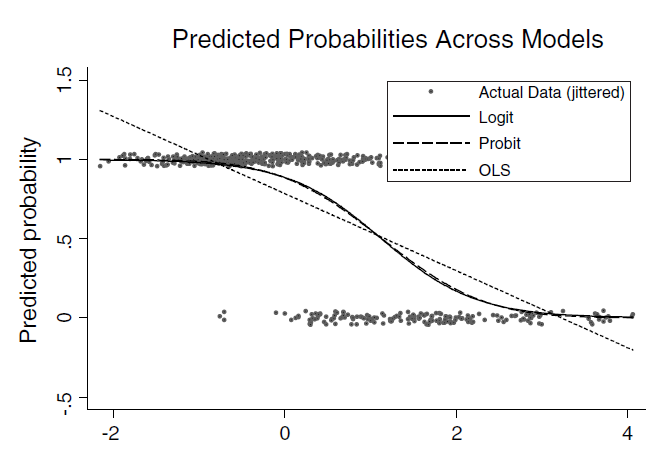

class: title-slide

```{r setup, include=FALSE}
knitr::opts_chunk$set(echo = FALSE, fig.path = "figures/")
library(tidyverse)
library(magick)
library(reticulate)

xfun::pkg_load2(c('base64enc', 'htmltools', 'mime'))
```

.title[
# Sesión 5. Variable dependiente binaria
]
.subtitle[
## Econometría II
]
.author[
### Irvin Rojas <br> [rojasirvin.com](https://www.rojasirvin.com/) <br> [<i class="fab fa-github"></i>](https://github.com/rojasirvin) [<i class="fab fa-twitter"></i>](https://twitter.com/RojasIrvin) [<i class="ai ai-google-scholar"></i>](https://scholar.google.com/citations?user=FUwdSTMAAAAJ&hl=en)
]

.affiliation[
### Centro de Investigación y Docencia Económicas <br> División de Economía
]

---
# Agenda
  
1. Estudiaremos las propiedades generales teóricas de estimadores en modelos cuando la variable dependiente es binaria

1. Mostraremos algunos resultados generales de las densidades de la familia lineal exponencial

1. Mostraremos las propiedades asintóticas de los estimadores de MV para este tipo de modelos

---

# Introducción

- Frecuentemente nos encontramos con problemas donde la variable dependiente es categórica

  - Probabilidad de comprar o no comporar un producto
  
  - Probabilidad de escoger el producto $j$ de entre $J$ posibles alternativas
  
  - Probabilidad de tener una tarjeta $k$ de entre las varias tarjetas $K$ que tiene una jerarquía
  
--

- MCO es inconsistente

- La correcta implementación de modelos de variable categórica se realiza por MV

- Afortunadamente ya sabemos mucho de MV

---

class: inverse, middle, center

# Variable dependiente binaria

---

# Variable dependiente binaria

- $y_i$ toma el valor de 1 si el evento se realiza y 0 si no

- Los datos siguen una distribución Bernoulli con probabilidad que varía entre individuos: $p\equiv p_i$

- Especificamos una forma funcional para la probabilidad y se estima por MV

---

# Modelo general

- La variable dependiente:
$$
y_i=
\begin{cases}
1 \quad\text{con probabilidad }p \\
0 \quad\text{con probabilidad }1-p
\end{cases}
$$
- Parametrizamos $p_i$ con un vector de características $x_i$ y un vector de parámetros $\beta$:

$$p_i=F(y_i=1|x_i)=F(x_i'\beta)$$
- A $x_i'\beta$ se le conoce como *índice*, por lo que este modelo es también un modelo de un índice único

--

- $F$ es una función de distribución acumulada (cdf)

- Un modelo de probabilidad lineal simplemente especifica $p_i=x_i'\beta$

---

# Probit y logit

- Un modelo probit especifica $F\cdot$ como una normal estándar con cdf dada por:

$$\Phi(x'\beta)=\int_{-\infty}^{\infty}\phi(z)dz$$

--

- Un modelo logit especifica a $F\cdot$ como una función logística:

$$\Lambda(x'\beta)=\frac{exp\{x'\beta\}}{1+exp\{x'\beta\}}$$
---

# Efectos marginales

- En un modelo lineal, $\beta_j$ tiene la interpretación directa del efecto de un cambio marginal en $x_j$ sobre $y$

- En cambio, en los modelos de probabilidad no lineal estamos interesaods en:

$$\frac{\partial P(y_i=1)|x_i)}{\partial x_{ij}}=F'(x_i'\beta)\beta_j$$

- Como $F(\cdot)$ es no lineal, los efectos marginales difieren del punto de evaluación, es decir, de $x_i'\beta$

--

- En el caso probit:

$$\frac{\partial P(y_i=1)|x_i)}{\partial x_{ij}}=\phi(x'\beta)\beta_j$$

--

- En el caso logit:

$$\frac{\partial P(y_i=1)|x_i)}{\partial x_{ij}}=\Lambda(x'\beta)(1-\Lambda(x'\beta))\beta_j$$
---

# Efectos marginales

- Dos efectos marginales que podemos calcular:

1. Promedio de efectos marginales:

$$\frac{1}{N}\sum_i F'(x_i'\hat{\beta})\hat{\beta}_j$$

1. Efecto marginal evaluacdo en la media de $x$:

$$F'(\bar{x}'\hat{\beta})\hat{\beta}_j$$
--

- Noten que el cociente de efectos marginales es igual al cociente de los coeficientes estimados:

$$\frac{\frac{\partial P(y_i=1)|x_i)}{\partial x_{ij}}}{\frac{\partial P(y_i=1)|x_i)}{\partial x_{ik}}}=\frac{\hat{\beta}_j}{\hat{\beta}_k}$$

---

# Estimación

- Tenemos a la mano datos $(y_i,x_i)$ de $N$ individuos

- La función de masa de probabilidad para $y_i$ es:

$$f(y_i|x_i)=p_i^{y_i}(1-p_i)^{1-y_i},\quad\quad y_i={0,1}$$
- Recordemos que $p_i=F(x_i'\beta)$

---

# Estimación

- La log densidad será:

$$\ln f(y_i)=y_i\ln p_i + (1-y_i)\ln(1-p_i)$$
--

- Por independencia sobre $i$, la función de log verosimilitud es:

$$\mathcal{L}(\beta)=\sum_i\{y_i\ln p_i + (1-y_i)\ln(1-p_i)\}$$
--

- Sustituyendo $F$ en vez de $p_i$:


$$\mathcal{L}(\beta)=\sum_i\{y_i\ln F(x_i'\beta) + (1-y_i)\ln(1-F(x_i'\beta))\}$$
---

# Estimación

- La condición de primer orden implica que $\hat{\beta}_{MV}$ resuleve:

$$\sum_i \left(\frac{y_i-F(x_i'\beta)}{F(x_i'\beta)(1-F(x_i'\beta))}F'(x_i'\beta)x_i\right)=0$$

---

class: inverse, middle, center

# Cuasi máxima verosimilitud

---
# Cuasi máxima verosimilitud

- Hagamos aquí una breve desviación a un tema un general de MV y luego veremos cómo empata con la discusión sobre los modelos de probabilidad no lineal

--

- Un estimador $\hat{\theta}_{CMV}$ es aquel estimador que maximiza una función de log verosimilitud que está mal especificada

- Generalmente, si la densidad está mal especificada, el estimador de MV será inconsistente

- En casos especiales, el estimador de CMV es aún consistente

---

# Familia lineal exponencial

- Una densidad de la familia lineal exponencial puede ser expresada como
$$f(y|\mu)=\exp\{a(\mu)+b(y)+c(\mu)y\}$$
- Diferentes formas funcionales para $a$, $b$ y $c$ dan lugar a distintas densidades

- Algunas densidades comúnmente usadas que son de la familia lineal exponencial incluyen la normal (con varianza conocida), la Bernoulli, la exponencial y la Poisson (ver Tabla 5.4 en CT)

---

# Familia lineal exponencial

- Supongamos que parametrizamos la media como $\mu=g(x,\beta)$

- La función de log verosimilitud con una densidad de la familia lineal exponencial será:

$$\mathcal{L}_N(\beta)=\sum_i\left(a(g(x_i,\beta)+b(y_i)+c(g(x_i,\beta))y_i\right)$$

--

- Las condiciones de primer orden serán

$$\frac{\partial \mathcal{L}_N(\beta)}{\partial \beta}=\sum_i\frac{y_i-g(x_i\beta)}{(c'(g(x_i'\beta)))^{-1}}\frac{\partial g(x_i,\beta)}{\partial\beta}=0$$
- El estimador de CMV resuelve estas condiciones, pero no es necesario asumir que la densidad está correctamente bien especificada

- Gouriéroux, Monfort y Trognon (1984) probaron que el estimador de CMV es consistente si $E(y|x)=g(x,\beta_0)$, es decir, si la media condicional de $y$ dado $x$ está bien especificada

---

# Familia lineal exponencial

- Aun cuando la media condicional esté bien especificada, en la práctica se debe usar una matriz de varianzas de sándwich $A_0^{-1}B_0A_0^{-1}$, a menos de que la varianza condicional también esté bien especificada

- En el caso Bernoulli, la varianza condicional está bien especificada, por lo que basta usar 
$-A_0^{-1}$

--

- Hasta aquí el fin de esta nota

---

class: inverse, middle, center

# De regreso a variable dependiente binaria

---

# Consistencia

- Notemos que para datos Bernoulli se cumple que:

$$E(y)=1\times p+ 0 \times (1-p)=p$$
- Es decir, $E(y_i|x_i)=F(x_i'\beta)$, por lo que el lado derecho de las condiciones de primer orden tiene valor esperado de cero

- Es decir, el estimador de MV es consistente si la media condicional está bien especificada

--

- Esto ya lo sabíamos porque la Bernoulli es de la familia lineal exponencial

---

# Distribución asintótica

- Si la densidad está **bien especificada**, la teoría que vimos sobre MV indica que el estimador tendrá una distribución asintótica como sigue:
$$\hat{\beta}_{MV}\stackrel{a}{\sim}\mathcal{N}\left(\beta, \left(-E\left(\frac{\partial^2\mathcal{L}}{\partial\beta\partial\beta'}\right)\right)^{-1}\right)$$

- Tomando la derivada a las condiciones de primer orden y calculando el negativo del valor esperado obtenemos:

$$\hat{V}(\hat{\beta}_{MV})=\left(\sum_i\frac{1}{F(x_i'\hat{\beta})(1-F(x_i'\hat{\beta}))}F'(x_i'\hat{\beta})^2x_ix_i'\right)^{-1}$$
--

- Por nuestra discusión de la familia lineal exponencial sabemos que solo necesitamos correcta especificación de la media condicional para tener consistencia

- Pero que se recomienda usar una matriz de sándwich para estimar la varianza del estimador de MV

---

# Distribución asintótica

- En el caso Bernoulli, se puede mostrar que $A=-B$, por lo que el sándwich resulta $A^{-1}BA^{-1}=-A^{-1}$

- Solo en el caso Bernoulli, no hay ninguna ventaja al usar una matriz de varianzas robusta cuando los datos son independientes sobre $i$

- Veremos más adelante que cuando hay errores agrupados sí usaremos una matriz robusta

---

# Particularidades del modelo logit

- Una medida comúnmente usada es la razón de momios u *odds ratio*, también llamado riesgo relativo: $\frac{p}{1-p}$

- El riesgo relativo es la probabilidad de que suceda $y=1$ relativa a la probabilidad de que $y=0$

- En el caso del logit, el riesgo relativo es:

$$\frac{p}{1-p}=exp\{x'\beta\}$$

- Y el log del riesgo relativo es simplemente:

$$\ln\left(\frac{p}{1-p}\right)=x'\beta$$

- Es decir, el log del riesgo relativo o el log de la razón de momios es lineal en $x$

---

# Particularidades del modelo logit

- Noten que expresar las probabilidades como riesgo relativo tiene una interpretación usada comúnmente en bioestadística

- Si $\frac{p}{1-p}=exp\{x'\beta\}$ y $x_j$ cambia en una unidad, entonces el lado derecho se vuelve $exp\{x'\beta+\beta_j\}=exp\{x'\beta\} exp\{\beta_j\}$

- Es decir, el riesgo relativo se ha incrementado $exp\{\beta_j\}$ veces

- Supongamos que $\hat{\beta}_j=0.05$, entonces $exp\{0.05\}\approx 1.05$

--

- Es decir, el riesgo relativo se incrementa en aproximadamente 5%

---

# ¿Probit o logit?

- Empíricamente suelen desempeñarse de forma muy similar

- COmo nos interesan los efectos marginales, la diferencia entre los modelos usados suele ser mínima

- El modelo logit es frecuentemente usado en bioestadística por su interpretación en términos de riesgo relativo

- El probit se puede motivar por un modelo de variable latente normal, que se liga directamente al model Tobit (que veremos más adelante)


---

# Ventajas del uso de modelos de probabilidad no lineal

Tabla 14.1 CT
```{r, out.width="50%",fig.cap='Fuente: Cameron y Trivedi (2005)',fig.align='center'}

```

---

# Próxima sesión

-Exposición sobre modelos de probabilidad no lineal

  - Avila-Foucat, V. S., & Pérez-Campuzano, E. (2015). Municipality socioeconomic characteristics and the probability of occurrence of Wildlife Management Units in Mexico. *Environmental Science & Policy*, 45, 146-153.

- Veremos modelos multinomiales

  - CT Capítulo 15

---

class: center, middle

Presentación creada usando el paquete [**xaringan**](https://github.com/yihui/xaringan) en R.

El *chakra* viene de [remark.js](https://remarkjs.com), [**knitr**](http://yihui.org/knitr), y [R Markdown](https://rmarkdown.rstudio.com).

Material de clase en versión preliminar.

**No reproducir, no distribuir, no citar.**